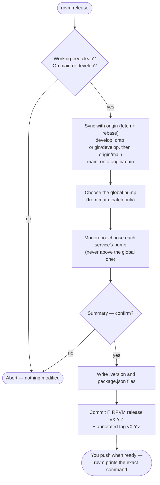

# Repo Version Manager (`rpvm`)

[](https://github.com/Gcuencam/repo-version-manager/actions/workflows/ci.yml)
[](https://www.npmjs.com/package/repo-version-manager)
[](https://www.npmjs.com/package/repo-version-manager)
[](https://packagephobia.com/result?p=repo-version-manager)
[](./LICENSE)

Interactive CLI to version a repository — or every service inside a monorepo — from your terminal, with git integration (branches, tags, rebase). You stay in control: **`rpvm` never pushes**.

## Why rpvm?

Tools like `semantic-release` or `changesets` automate versioning from commit conventions and CI pipelines. `rpvm` takes the opposite approach: a short interactive session where **you** decide every bump, review a summary of exactly what will happen, and nothing leaves your machine until you push it yourself.

- 🎛️ **Interactive and explicit** — pick every bump from a prompt; no commit-message conventions to learn.
- 🧩 **Monorepo-aware** — one global version for the repo, plus an individual version per service.
- 🚦 **Guard rails** — a service never bumps above the global bump, and from the main branch only `patch` (hotfix) releases are allowed.
- 🔄 **Git taken care of** — syncs with `origin` (fetch + rebase), then creates the release commit and the annotated tag for you.
- 🙅 **Never pushes** — commits and tags stay local; the CLI prints the exact push command for you to run.
- 🧪 **Dry run** — `rpvm release --dry-run` walks the whole flow without touching a single file.

## Quick start

```sh
npm install -g repo-version-manager

cd your-repo
rpvm init      # one-time setup: mode, services, versions and branches
rpvm release   # every time you want to cut a new version
```

Requires Node.js ≥ 18.19. The package installs a single binary: `rpvm`.

## Commands

### `rpvm init` — set up the repository (once)

Run it from the repository root. It asks you, with sensible defaults auto-detected from your project:

- Whether the repo is a **monorepo with services** (detected from your folder structure).
- In monorepo mode, **which first-level folders are services** (folders with a `package.json` come preselected) and each service's initial version.
- The **global version** (defaults to the root `package.json` version when available).
- The **main branch** (`main`/`master`) and the **development branch** (`develop`/`development`).

It then writes the config and version files (see [Generated files](#generated-files)), updates the `package.json` versions, commits everything (`🔖 RPVM init vX.Y.Z`) and, optionally, creates the initial `vX.Y.Z` tag.

### `rpvm release` — cut a new version

The everyday command. It checks that the working tree is clean and that you are on the main or the development branch, rebases onto `origin`, and then walks you through the bumps:

```
┌   rpvm release
│
◇  Branch up to date with origin.
│
◇  Global release type (current version: 1.2.3)
│  minor (1.2.3 → 1.3.0)
│
◇  Bump api? (current: 0.9.1)
│  minor (0.9.1 → 0.10.0)
│
◇  Bump web? (current: 2.1.0)
│  no bump (stays at 2.1.0)
│
◇  Release v1.3.0 summary ────╮
│                             │
│  global  1.2.3 → 1.3.0      │
│  api     0.9.1 → 0.10.0     │
│  web     2.1.0 (unchanged)  │
│                             │
├─────────────────────────────╯
│
◇  Generate release v1.3.0?
│  Yes
│
◇  Version files updated.
│
◇  Commit and tag v1.3.0 created.
│
◇  Next step ──────────────────────────────────────────────────╮
│                                                              │
│  rpvm does not push. When you want to publish the release:   │
│    git push --force-with-lease origin develop                │
│    git push origin v1.3.0                                    │
│                                                              │
├──────────────────────────────────────────────────────────────╯
```

Nothing is written until you confirm the summary. Add `--dry-run` to walk the whole flow and see the list of actions without modifying anything.

### `rpvm status` — where am I?

Shows the global version (and each service's version in monorepo mode) and warns when a `package.json` is out of sync with its `.version` file:

```
┌   rpvm status
│
◇  Versions ───────────────────────────────╮
│                                          │
│  global  v1.2.3  ✔ package.json in sync  │
│                                          │
├──────────────────────────────────────────╯
│
└  main: main · develop: develop · current: develop
```

## How a release works



The rules behind the flow:

- A service bump never exceeds the global one (`patch` < `minor` < `major`); a service may also stay unchanged.
- From the main branch only `patch` releases are generated — features ship through the development branch; main is for hotfixes.
- Git tags (`vX.Y.Z`) track the global version.
- On the development branch the suggested push uses `--force-with-lease` (the branch was just rebased); on main it never suggests forcing.

## Generated files

| File | Where | Content |
|---|---|---|
| `.rpvmrc.json` | root | mode (monorepo or not), branches and service list |
| `.version` | root | global repository version |
| `.version` | each service (monorepo mode) | service version — the **source of truth**, `package.json` follows it |

## FAQ

**The rebase hit conflicts. Is my repo in a weird state?**
No. `rpvm` aborts the rebase and exits without modifying anything. Resolve the conflicts manually (`git rebase origin/<branch>`) and run `rpvm release` again.

**`rpvm status` warns that a `package.json` is out of sync.**
`.version` is the source of truth. Someone edited a `package.json` version by hand — set it back to the `.version` value (the next release will rewrite it anyway).

**Can I use it without a remote? Without git at all?**
Yes. With no `origin` remote, the sync step is skipped (you'll see a warning). With no git repository, `rpvm` only manages the version files — no commits, no tags.

**I cut a release locally and regret it. How do I undo it?**
As long as you haven't pushed: `git tag -d vX.Y.Z && git reset --hard HEAD~1`. That's the point of never pushing automatically.

**Why only `patch` from main?**
Main represents what's in production. New features go through the development branch and reach main via a regular release; anything released directly from main is by definition a hotfix.

## Development

```sh
git clone https://github.com/Gcuencam/repo-version-manager.git
cd repo-version-manager
npm install
npm run dev        # tsup in watch mode
npm run typecheck
npm test
npm run build
npm link           # try `rpvm` locally
```

Found a bug or have an idea? [Open an issue](https://github.com/Gcuencam/repo-version-manager/issues).

## License

[MIT](LICENSE)
